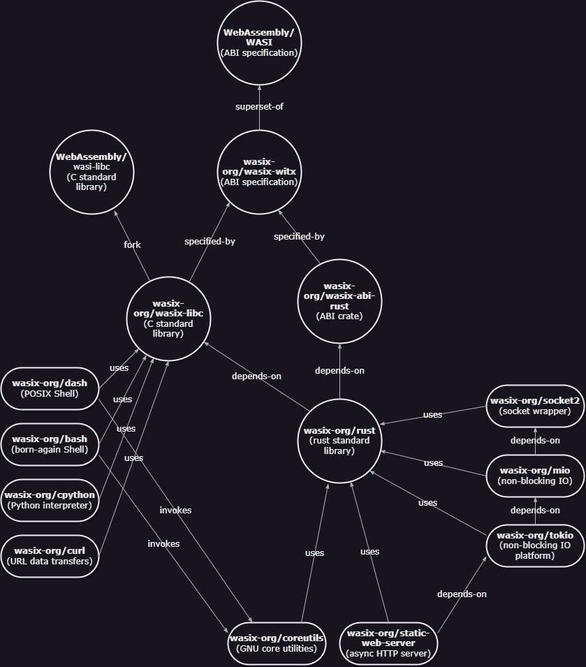

# WASI(X) Extensions Spec

[WASIX](https://wasix.org) is maintained by wasix.org.

WASI(X) intent is to extend the WASI proposal and complete the ABI sufficiently
now to build useful and productive applications today - it is not intended as a
fork but rather to be a superset on top of WASI. Therefore it maintains full
forwards and backwards compatibility with this major version of WASI and
stabilizes it for the long term.

# Current Extensions

Below are the current extensions supported by WASIX, they are all fully tested and
incorporated into supporting runtime(s):

- full support for efficient multithreading including joins, signals
  and `getpid`
- `pthreads` support (now extended from the WASI threads spec)
- full support for sockets (`socket`, `bind`, `connect`, `resolve`)
    - IPv4, IPv6
    - UDP, TCP
    - Multicast, Anycast
    - RAW sockets
- current directory support (`chdir`) integrated with the runtime
- `setjmp` / `longjmp` support (used extensively in `libc` ) via `asyncify`
- process forking (`fork` and `vfork` )
- subprocess spawning and waiting (`exec` , `wait` )
- TTY support
- asynchronous polling of sockets and files
- pipe and event support (`pipe`, `event` )
- DNS resolution support (`resolve` )

# WASI(X) Contributions

All contributions are welcome on extending WASI(X) with other extension(s). Just submit your pull request
here and we will review via normal GitHub processes.

# Long-term Support

WASIX will receive long term support by this community with a guarantee of backwards compatibility on the ABI.
Runtime(s) that support this ABI are assured of its stability just as standard libraries and libraries can
also count on that same stability to join the dots and make the connections.

Major bug fixes and/or zero day vulnerabilities will be addressed promptly here with careful consideration for
resolving issues without compromising the long-term support goal.

# Dependency Graph

